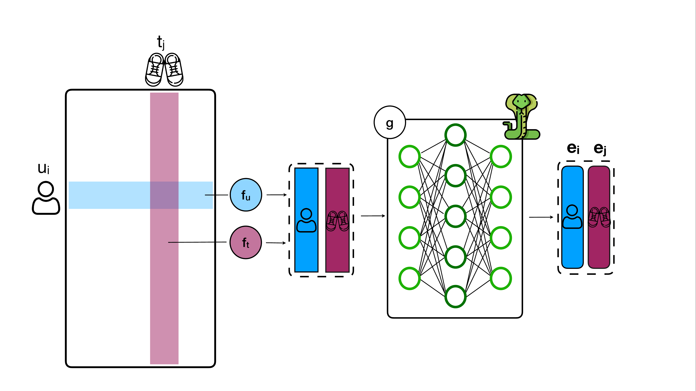

# Parameter-Efficient Single Collaborative Branch for Recommendation
Repository for `CoBraR` - Collaborative Branch Recommender. This work has been accepted as LBR at RecSys'25. 




# Project structure
```bash
.
├── config_files
│  ├── datasets
│  │  ├── amazon_baby.yml
│  │  ├── dataset_defaults.yml
│  │  └── ml1m.yml
│  ├── DEFAULT.ymlemo
│  ├── models
│  │  ├── bprmf.yml
│  │  ├── cobrar.yml
│  │  ├── deepmf.yml
│  │  ├── model_defaults.yml
│  │  └── simple.yml
│  └── tmp.yml # Will be created after each run
├── dataset # can be downloaded at the link below
│  ├── amazon_elliot
│  │  └── baby
│  │      ├── test.tsv
│  │      ├── train.tsv
│  │      └── val.tsv
│  └── movielens1m_elliot
│      └── movielens_1m
│          ├── dataset.tsv
│          └── movielens_1m_splits
│              └── 0
│                  ├── 0
│                  │  ├── train.tsv
│                  │  └── val.tsv
│                  └── test.tsv
├── elliot
│  ├── ... # Elliot structure
│  ├── run.py
│  ├── splitter # Elliot splitter
│  │  ├── ...
│  └── utils # Elliot utils
│      ├── ...
├── external
│  └── models
│      ├── bprmf
│      │  ├── BPRMFModel.py
│      │  ├── BPRMF.py
│      │  └── __init__.py
│      ├── cobra
│      │  ├── CoBraRModel.py
│      │  ├── CoBraR.py
│      │  └── __init__.py
│      ├── deepmf
│      │  ├── DeepMFModel.py
│      │  ├── DeepMF.py
│      │  └── __init__.py
│      └── __init__.py
├── log
│  └── elliot.log
├── README.md
├── requirements_torch_geometric.txt
├── requirements_torch.txt
├── requirements.txt
├── results # Will be created after each run
│  └── movielens_1m
│      ├── performance
│      ├── recs
│      ├── user_level
│      └── weights
└── amazon_baby
│      ├── performance
│      ├── recs
│      ├── user_level
│      └── weights
├── run.py
├── run_sep.py
├── run_split.py
└── utils.py
```

# Setup
Configure your `conda` environment:
 1. create the environment
```bash
conda create env -n cobrar python=3.9
conda activate cobrar
pip install --upgrade pip
pip install -r requirements.txt
pip install -r requirements_torch.txt 
```
 2. install [elliot](https://github.com/sisinflab/elliot) requirements
```bash
pip install --upgrade pip
pip install -r requirements.txt
```
 4. set the WANDB_API_KEY environment variable.
```bash
export WANDB_API_KEY=<your_api_key>
```
5. install wandb and log in.
```bash
pip install wandb
wandb login
```

# Dataset
Download the datasets from Zenodo:
https://zenodo.org/records/15309922

Put them in the dataset folder showed in the tree above (or wherever you want, but then change the paths in the configs accordingly ;)

# Run experiment
1. (optional) adapt the config files for the models
2. run an experiment with `run_sep.py`. For instance, to run `CoBraR` on `ml1m`, type
```bash
python.py run_sep.py --model cobrar --data ml1m
```
# Citation 
If you use CoBraR or this code, cite
```
@inproceedings{moscati2025cobrar,
    title = {Parameter-Efficient Single Collaborative Branch for Recommendation},
    author = {Moscati, Marta and Nawaz, Shah and Schedl, Markus},
    booktitle = {Proceedings of the 19th ACM Conference on Recommender Systems (RecSys)},
    publisher = {Association for Computing Machinery},
    address = {New York, NY, USA},
    url = {https://doi.org/xx.xxxx/xxxxxxx.xxxxxxx},
    doi = {xx.xxxx/xxxxxxx.xxxxxxx},
    pages = {xxx-yyy},
    location = {Prague, Czech Republic},
    year = {2025}
} 
```

Since the code also relies on Elliot, please also see [its repository](https://github.com/sisinflab/elliot) for how to cite it. 
